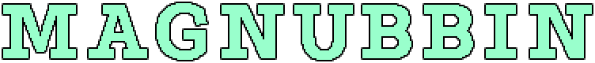

Loop.Coop Present: Magnubbin
============================

#### A super-rapid 3D prototyping system

##### __Get Started__

1.  Click on the white background to show the ‘Scene’ menu
2.  Click ‘Add’, and click one of the eight tetrahedrons
3.  Click-and-drag ‘Scale’ to change its size
4.  Click-and-drag ‘Move x y’ to move it left/right and up/down
5.  Click-and-drag ‘Move x z’ to move it left/right and in/out
6.  Click-and-drag the ‘Rotate’ buttons
7.  Click the white background to show the ‘Scene’ menu
8.  Click ‘Add’ to create another tetrahedron
9.  Click the white background to show the ‘Scene’ menu
10. Click-and-drag ‘Zoom’, ‘Move’ and ‘Rotate’ to change the view
11. Click ‘Reset’ to return to the original view
12. Click ‘Save’ for a unique URL to keep or share

[Fork Magnubbin on GitHub](https://github.com/loopdotcoop/magnubbin "GitHub")
